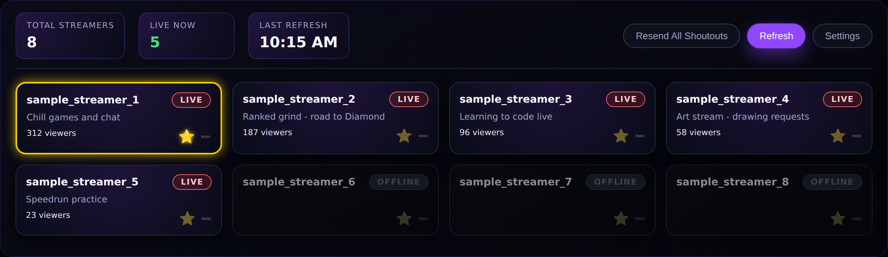
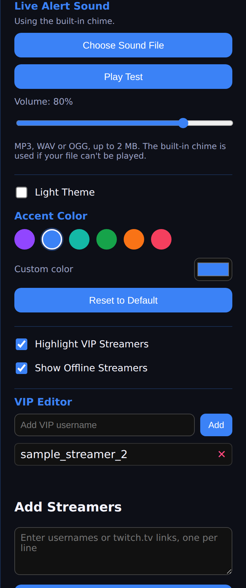

# Twitch Live Checker

Ever wish you didn't have to keep checking Twitch to see if your favorite streamers are live? This app does it for you.

Twitch Live Checker sits quietly on your desktop and keeps an eye on a list of streamers you choose. It shows you who's live right now, what they're playing, and how many people are watching — and it can even post a shoutout for them in your own chat the moment they go live, so you never miss the chance to support someone.



*(The names above are just samples — your dashboard will show whichever streamers you add.)*

## What it does

- **See who's live at a glance** — title, viewer count, and live/offline status for everyone on your list
- **Star your favorites** so they're always sorted to the top
- **Get a sound alert** the moment someone goes live — use the built-in chime or pick your own sound
- **Auto-refreshes** on whatever schedule you like (every minute up to once an hour)
- **Automatic shoutouts** — say `!so username` in your own chat the instant someone you follow goes live, no need to remember or type it yourself
- **Make it yours** — light or dark mode, plus your choice of accent color
- Add streamers just by pasting their name or their `twitch.tv/` link
- Everything runs on your own computer, using your own Twitch login — nothing about your setup is sent anywhere else

## Installing it

The easiest way to get started:

1. Look for **Releases** on the right-hand side of this page (or go to the repo's `/releases` URL) and open the latest one. Download the file that looks like `Twitch Live Checker Setup.exe` — it's a separate download from the source code above it, and it's normal for it to be around 100 MB
2. Run it and follow the prompts — it installs like any normal Windows program
3. **Windows may show a blue "Windows protected your PC" warning.** This happens because the app isn't signed with an expensive commercial certificate, not because anything is wrong. Click **More info**, then **Run anyway**.
4. When it opens for the first time, a short setup screen will walk you through everything else — see below

That's it — no need to install Node.js, git, or anything technical. That stuff is only for people who want to look at or modify the code itself (see [Running it from the source code](#running-it-from-the-source-code) below).

## Setting it up

The first time you open the app, it'll ask you to connect it to Twitch. This is a one-time thing.

### 1. Create your own Twitch connection

Because of how Twitch works, every copy of this app needs its own set of "keys" to talk to Twitch — think of it like registering the app so Twitch knows who's asking for data. This sounds technical, but it only takes a minute:

1. Go to **dev.twitch.tv/console** and log in with your normal Twitch account
2. Click **Register Your Application**
3. Fill in the form:
   - **Name:** anything you like, as long as it's not already taken and doesn't contain the word "twitch" — e.g. `MyName Live Checker`
   - **OAuth Redirect URLs:** type exactly `http://localhost:3000`
   - **Category:** Application Integration
   - **Client Type:** Confidential
4. Click **Create**, open the application you just made, and click **New Secret**
5. You'll now see a **Client ID** and a **Client Secret** — keep this page open, you'll need to copy both into the app in the next step

Treat the Client Secret like a password. Don't share it with anyone or post it anywhere.

### 2. Follow the in-app setup

Back in the app, the setup screen will ask you for:

- The **Client ID** and **Client Secret** you just created
- Whether you want **automatic shoutouts** — if yes, you'll click a button to log in with Twitch (just approve it in your browser, nothing to copy or paste), and you can set the exact message it posts
- A few streamers to start tracking, if you'd like (you can always add more later)

Once you finish, you're in the dashboard and ready to go. Anything from this setup screen can be changed later from **Settings**.

### Matching your existing shoutout command

If you already use a chat bot like StreamElements or Nightbot with your own `!so` command, just make sure the shoutout message in this app's Settings matches what your bot expects — that way the automatic shoutout triggers your bot exactly the way typing it yourself would.

### Using a separate bot account (optional)

By default, shoutouts post from your own account. If you'd rather have a separate bot account send them instead, there's a dropdown for that in Settings — pick "A separate bot account," log it in the same simple way, and you're set. Your own account automatically gives that bot permission to post in your channel, so there's no extra step.

## Making it yours

Both of these live in **Settings**, and both are remembered the next time you open the app.



### Choosing your own alert sound

The app comes with a built-in chime, but you can use any sound you like:

1. Open **Settings** and find **Live Alert Sound**
2. Click **Choose Sound File** and pick an MP3, WAV, or OGG file (up to 2 MB — short and sweet works best)
3. It plays right away so you can hear what you picked. Use **Play Test** any time, and the **Volume** slider to set how loud it is
4. Changed your mind? **Use Built-in Chime** puts the original back

A few things worth knowing:

- The app keeps its own copy of your sound, so it's fine to move or delete the original file afterward
- If your file ever can't be played, the built-in chime plays instead, so you won't miss an alert
- To turn alerts off completely, uncheck **Play Live Alert Sound**

### Changing the colors

Don't love the default purple? Under **Accent Color** you can:

- Tap one of the preset colors, or pick any color you like with **Custom color**
- Go back to the original with **Reset to Default**

The accent color is used for buttons, headings, and highlights. It works with **Light Theme** too, and button text switches between light and dark automatically so it stays easy to read. The red/gray live and offline badges keep their colors so they always mean the same thing. If you pick a custom color that would blend into the background, the app will ask you to try a different one.

## Your privacy

Everything you set up — your Twitch keys, your streamer list, your login, your custom alert sound — stays on your own computer. None of it is sent to me or anyone else. Your login and secret key are also encrypted using your Windows account's own built-in protection, the same kind of security Windows uses to protect your other saved passwords.

## Running it from the source code

If you're comfortable with code and want to run this from the source files instead of the installer, or make your own changes:

```bash
git clone <this-repo-url>
cd twitch-live-checker
npm install
npm start
```

Node.js 18 or later is required for this.

### Building your own installer

```bash
npm run build
```

This creates a Windows installer in a new `dist` folder, using a tool called electron-builder.

### Running the tests

```bash
npm test
```

This runs the project's automated checks to make sure nothing's broken.

### How the project is organized

```
twitch-live-checker/
├─ main.js              App startup, window, and tray icon
├─ preload.js           Safe bridge between the app's UI and the system
├─ src/                 The app's inner workings (Twitch connection, login, settings, shoutouts)
├─ public/              Everything you see on screen (dashboard, setup screen, icons, sound)
├─ test/                Automated tests
└─ docs/                Sample screenshots used in this README
```

## License

MIT — see LICENSE.

## Contributing

Issues and pull requests are welcome! If you're reporting a problem, please double check that any screenshots or logs don't include your real Twitch username, login tokens, or keys.
